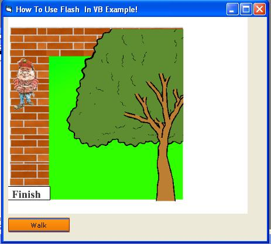



## Flash And Action Script With VB6\(

### Description

This code demonstrates how to use macromedia flash files in vb6...this means that with it you

can send the flash player values...I've done this here with setting the value of a variable which was

declaired and used in the ".fla" file from within the vb programme,and flash player can also send

values to your vb programme.You'll have to use the Shockwave Flash Component...and set the

"Allow Action Script" to "alwaya" which is the default value i think...In this example I have a flash

file...when you click the "Walk" button the vb programme tells the flash player to move the

character...and when the character reaches the "Finish" thingy the flash player tells vb that so...

Its my first submission here,and i've seen few things like this here, but they were all just

examples of how to use flash files in vb and thats all...whereas this examples tells how to use

the action script of the flash file from vb6.This a part of an another project which i'm doin'...and

being a beignner I find ths quiet usefull! :)....SPACIAL THANX TO THE isButton..which i'm using

in this programme..ITS AWSOME!..if u don't have downloaded it already then please do so from

this site...this gives you programme very cool look ;)

I've updated this submission with the "*.fla" file this time,and now you can view the flash code if it is not deleted by PSC :)

anyways here is the Action Script

Paste This Code On The First Frame

walk=a Movie Clip...The Walkin Character

fin= A Movie Clip...The Finish Thing At The Bottom

var Move;

Move=0

_root.onEnterFrame = function() {

if(Move==1)

{

walk._y=walk._y+2;

}

if(_root.walk.hittest(_root.fin))

fscommand("fin", "true");

}

By Aryan Sinha
 
### More Info
 

             |
---                |---
**Submitted On**   |2005-04-14 07:22:38
**By**             |[Aryan \(Vinny\)](https://github.com/Planet-Source-Code/PSCIndex/blob/master/ByAuthor/aryan-vinny.md)
**Level**          |Beginner
**User Rating**    |4.8 (19 globes from 4 users)
**Compatibility**  |VB 6\.0
**Category**       |[Graphics](https://github.com/Planet-Source-Code/PSCIndex/blob/master/ByCategory/graphics__1-46.md)
**World**          |[Visual Basic](https://github.com/Planet-Source-Code/PSCIndex/blob/master/ByWorld/visual-basic.md)
**Archive File**   |[Flash\_And\_1876474132005\.zip](https://github.com/Planet-Source-Code/aryan-vinny-flash-and-action-script-with-vb6__1-59995/archive/master.zip)

